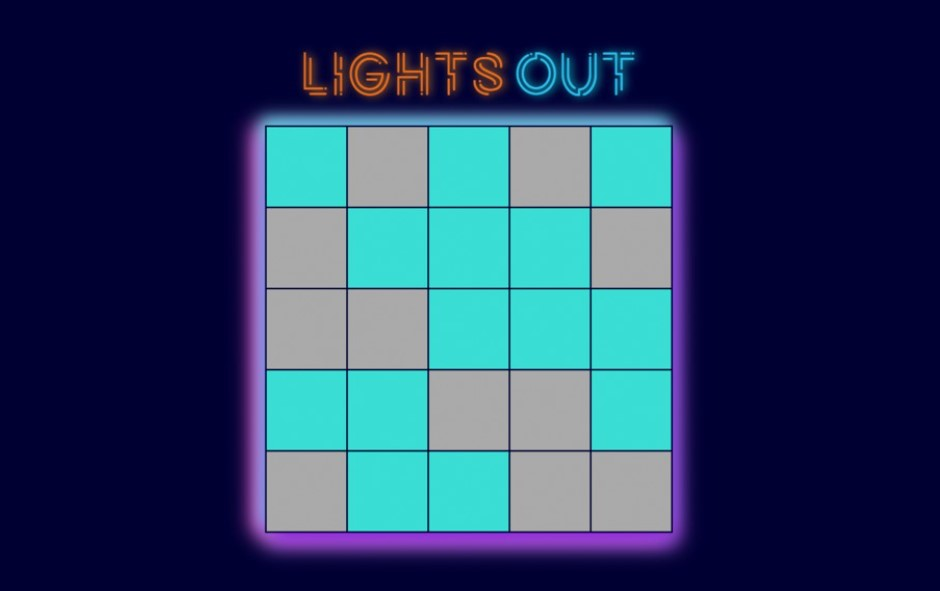

## Lights Out

<b>Built with</b> 

- The goal of the game is to switch off all the lights by clicking on cells. 
- Clicking on a cell toggles the on/off state of adjacent cells
- The game was implemented using React, with a focus on handling events.

<h2><a href="https://anushkabahuguna.github.io/lights-out/">Demo</a></h2>

